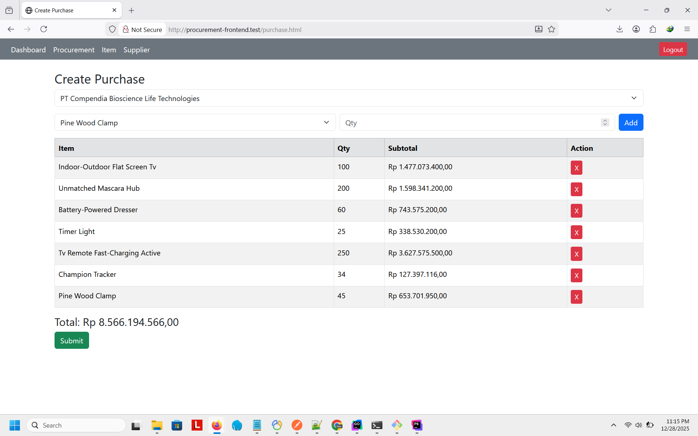

# Basic Procurement Frontend

Aplikasi **Frontend Procurement Sederhana** yang dibangun menggunakan **HTML, CSS, dan JavaScript**.
Proyek ini dirancang untuk mendemonstrasikan alur dasar sistem procurement dan terintegrasi
dengan **Backend Golang menggunakan Fiber Framework**.

---

## Demo Aplikasi

**Live Demo:**  
https://procurement-simple.netlify.app

> Repository Backend 
> https://github.com/bahrudin/procurement-api

---

## Screenshot Aplikasi


| Halaman | Screenshot |
|-------|------------|
| Purchase |  |

---

## Fitur Utama

- Autentikasi Pengguna (Login & Register)
- Dashboard Monitoring
- Manajemen Supplier
- Manajemen Item
- Proses Purchase
- Daftar & Detail Purchase
- Autentikasi berbasis Token (JWT)
- Struktur JavaScript modular
- Terintegrasi REST API

---

## Struktur Project

```
basic-procurement-frontend/
│
├── index.html
├── login.html
├── register.html
├── dashboard.html
├── suppliers.html
├── items.html
├── purchase.html
├── purchase_list.html
├── purchase_detail.html
│
├── assets/
│   ├── css/
│   ├── images/
│   └── js/
│       ├── auth.js
│       ├── config.js
│       ├── dashboard.js
│       ├── items.js
│       ├── suppliers.js
│       ├── purchase.js
│       ├── purchase_list.js
│       └── purchase_detail.js
│
└── structure.txt
```

---

## Konfigurasi Frontend

Atur URL API backend pada file berikut:

```javascript
// assets/js/config.js
const API_BASE_URL = "http://localhost:3000/";
```

Sesuaikan dengan alamat backend Anda.

---

## Backend (Golang + Fiber Framework)

Frontend ini dirancang untuk terhubung dengan backend yang menggunakan:

- **Golang**
- **Fiber Framework**
- **JWT Authentication**
- **Database MySQL / PostgreSQL**
- **RESTful API**

### Contoh Endpoint Backend

```
POST   /api/auth/login
POST   /api/auth/register

GET    /api/dashboard

GET    /api/suppliers
POST   /api/suppliers

GET    /api/items
POST   /api/items

POST   /api/purchases
GET    /api/purchases
GET    /api/purchases/:id
```

### Repository Backend

https://github.com/bahrudin/procurement-api

---

## Cara Menjalankan Frontend

1. Clone repository:
   ```bash
   git clone https://github.com/bahrudin/basic-procurement-frontend.git
   ```

2. Buka file `index.html` melalui browser  
   *(Disarankan menggunakan Live Server)*

3. Pastikan backend Golang Fiber sudah berjalan

---

## Teknologi yang Digunakan

### Frontend
- HTML5
- Bootstrap
- JavaScript
- Jquery
- Sweetalert

### Backend
- Golang
- Fiber Framework
- JWT
- MySQL / PostgreSQL

---

## Tujuan Penggunaan

- Prototype Sistem Procurement
- Pembelajaran ERP / Inventory
- Contoh Integrasi Frontend + Golang Fiber
- Project Portofolio

---

## Lisensi
MIT License © 2025 Bahrudin Ardiansyah

Proyek ini sebagai portofolio bersifat open-source dan bebas digunakan untuk keperluan pembelajaran dan pengembangan.

# basic-procurement-frontend
